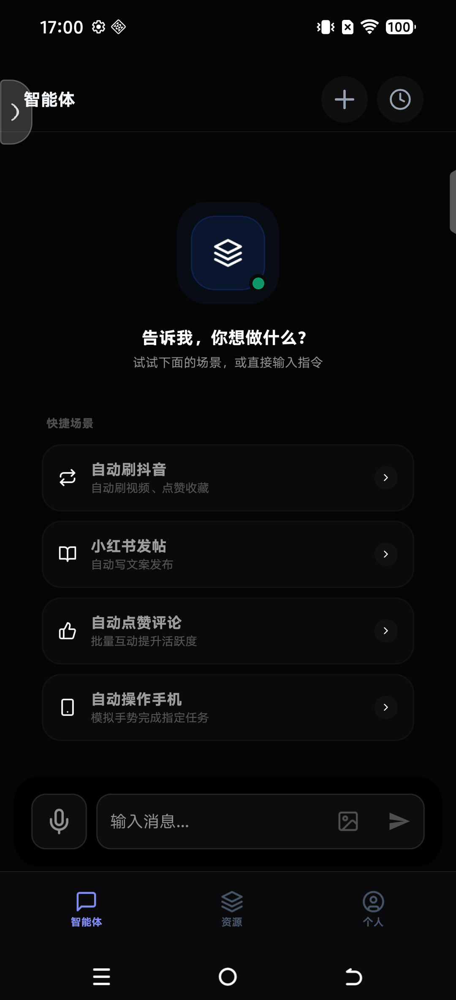
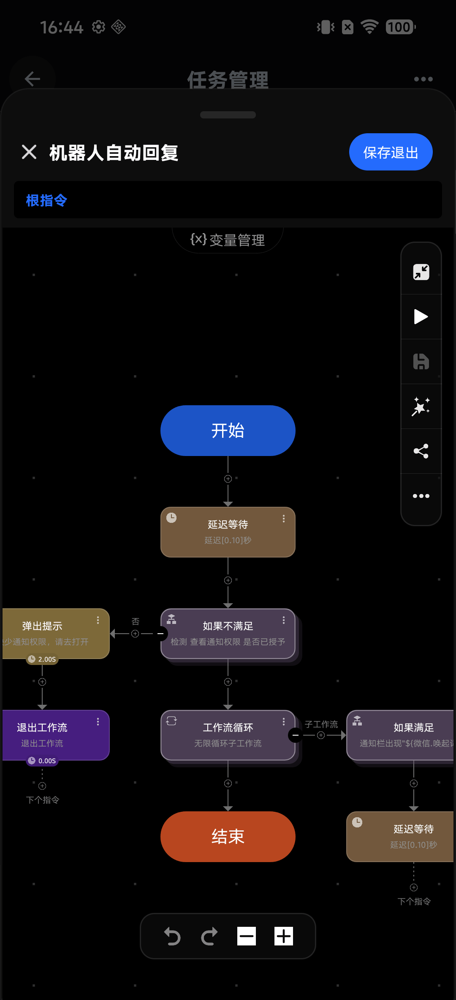
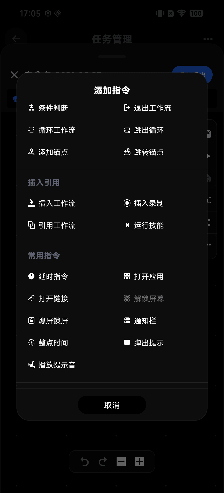
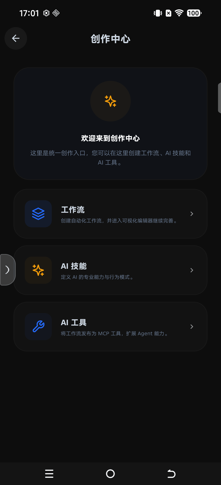
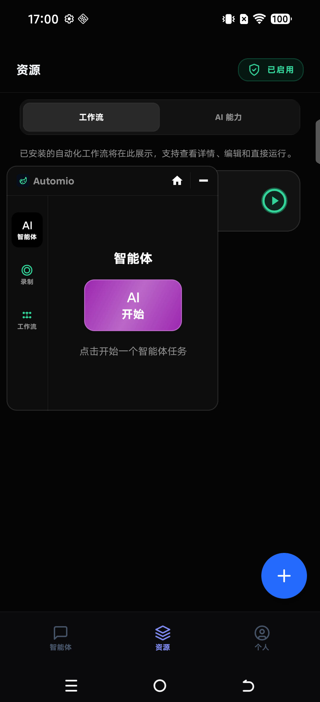

# Automio

[中文](README.md) | [English](README_EN.md)

**Automio：让 AI 真正在你的 Android 手机上动手干活**

Automio 是跑在 Android 上的 **全功能手机 Agent**：一边用大模型理解你的意图，一边用真实设备能力（点屏幕、识字、找图、开应用、跑脚本）把事情做完。  
它不只是聊天框，也不是一次性脚本录制——**能力边界可以自己往外扩**：

- 用 **Skill** 扩展「会什么」
- 用 **固定工作流** 扩展「怎么稳定干」
- 用 **可视化 / DSL 编辑器** 把复杂流程固化下来，下次人或 AI 直接调用

**不需要 Root，不需要 Xposed / LSPosed。** 权限按功能收敛、用到再动态申请，任意品牌手机都能装、都能跑。AI 配好 Key 就能上线；不配 AI 时，固定工作流照样离线执行。

---

### 30 秒看懂它能干嘛

| 你想做的事 | Automio 怎么做 |
| ---------- | -------------- |
| 跟手机说话，让它帮你点完一套操作 | **Agent 对话** → 调工具 / 工作流 → 看屏、点击、回报结果 |
| 同一个复杂流程每天都要跑，不想每次重新跟 AI 解释 | **做成固定工作流**，一键 / 定时离线执行 |
| 流程已经跑通，希望以后对话里 AI 直接「调这个本事」 | **发布成 Skill / Tool**，Agent 下次按需调用 |
| 界面老改版，纯坐标录制老挂 | **找图 / OCR / 控件** + 可视化编辑，改几步就能跟 |
| 电脑上的 Agent 也想用手机能力 | **本机 MCP**，局域网里当工具节点 |
| 不想 Root、不想折腾框架 | **正规权限**（无障碍、截屏等），动态申请，兼容任意机型 |

---

## 举几个真实用法

**1. 复杂任务「固化」一次，以后躺着跑**  
你要持续维护一套步骤很多、但逻辑高度固定的任务（比如：打开某 App → 翻到指定页 → 找按钮 → 填表 → 确认 → 截图存档）。  
→ 用工作流编辑器搭好 **固定工作流**，本地一键跑或闹钟定时跑，**不联网、不烧 Token**。

**2. 固化完，再「教给」AI**  
同上那个工作流跑稳了，不想每次还在对话里从头指挥。  
→ 发布成 **AI Skill / Tool**。下次你说「跑一下上周那个归档流程」，Agent **直接调用**，不用再逐步点。

**3. 偶发、难固定的事，交给 Agent 临场发挥**  
「看看通知里有没有快递，打开对应 App 把取件码读出来」。  
→ 走 **对话 Agent**：看屏、识字、点控件，多步试到做完。固定不了的用智能；固定得了的用工作流。

**4. 团队 / 自己多机复用**  
流程在 A 手机调通。  
→ 导出 `.zip` **资源包**（工作流 + 依赖 Skill / Tool + 权限声明），B 手机导入就能用。没有商场，也能分发。

**5. 流程里夹计算、夹脚本**  
采集完一堆数据要算、要写文件。  
→ 工作流步骤里嵌 **Python**，算完再回到点击 / 上传步骤。

**6. 电脑 Agent 调用手机**  
电脑上的 Coding Agent 需要「帮我在手机上打开某某并截一张图」。  
→ 打开 **本机 MCP**，手机侧工具对外暴露，远程按协议调用。

一句话：**能固定的做成工作流（可离线、可复用、可发布成 Skill）；不能固定的交给 Agent 临场干；两边用同一套设备能力，能力还能越扩越多。**

---

## 界面预览

| Agent 对话 | 可视化工作流 | 添加指令 |
| :--------: | :----------: | :------: |
|  |  |  |

| 创作中心 | 资源与悬浮窗 |
| :------: | :----------: |
|  |  |

---

## 核心能力

| 能力 | 说明 |
| ---- | ---- |
| **手机 Agent** | 多步规划与执行：看屏幕、点控件、读文字、开应用，结果写回对话再继续，直到做完 |
| **Skill 扩展** | 自定义 Prompt + 工具约束；可被对话调用，也可被工作流 `runSkill` |
| **固定工作流** | 可视化 + `.sc` DSL；独立运行、定时运行，或发布成 AI 可调用的工具 |
| **强编辑器** | 节点编排与源码编辑；找图 / OCR / 坐标 / 控件 / 流程控制一手齐 |
| **离线执行** | 不配 AI 也能跑工作流；配了 AI 也只在需要智能时才请求模型 |
| **MCP** | 设备侧 SSE / Streamable HTTP，本机或局域网扩展工具边界 |
| **视觉与 OCR** | OpenCV 找图 / 找色；ML Kit 中英文识字 |
| **语音交互** | Azure Speech TTS / ASR（`voiceInteract`、Agent 语音输入）；凭证进 Keystore |
| **定时与 Python** | 闹钟级计划任务；流程内嵌 Chaquopy Python |
| **正规权限** | 无 Root / 无 Xposed；权限收敛、动态申请，兼容任意 Android 手机 |

### 工作流命令速览

| 类别 | 例子 |
| ---- | ---- |
| 手势 | `click`、`press`、`scroll`、`pinch`、`repeatTap` |
| 图像 / 文字 / 控件 | `clickImage`、`clickText`、`clickColor`、`clickView`、`readScreenText` |
| 系统 | 返回 / Home、锁屏解锁、`openApp`、`openUrl` |
| 流程 | `delay`、`for`、`if`、`jump`、`callScript`、`set`、`log` |
| 智能扩展 | `runSkill`、`aiRequest`、`python`、`voiceInteract` |

---

## 权限与兼容

- **不做** Root、Xposed、系统 Hook、厂商助手劫持
- **按需申请**：无障碍、悬浮窗、截屏、通知等，用到再要，可随时在系统设置撤回
- **机型友好**：不绑特定 ROM / 品牌，任意 Android 手机（满足 minSdk）均可使用
- API Key / 语音凭证进 **Android Keystore**；未配置 Provider 时 **不会**调用默认云端
- MCP `voiceInteract`、工作流里勿硬编码 Speech Key；`curl` Header 勿提交真实 Bearer

只运行你信任的工作流与 Skill；导入资源包前核对依赖和权限声明。

---

## 和常见方案比，强在哪

市面上几类产品各占一头，很少能同时做到：**真能干活、能固化复用、能给 AI 调用、能离线跑、还能免 Root 装任意手机**。Automio 的差异不在「多一个聊天框」，而在把这几件事接成同一条能力链。

### 总表对照

| 维度 | 宏 / 按键精灵 / Auto.js 类 | 只会聊天的 App Agent（沙盒） | 厂商手机助手 | 要 Root / Xposed 的系统 Agent | RPA / 电脑端搬到手机 | **Automio** |
| ---- | --- | --- | --- | --- | --- | --- |
| 真实操作手机 UI | 强（录坐标 / 简单找图） | 弱或不能 | 有限、偏自家生态 | 很强（可 Hook） | 看移植深度 | **强（无障碍 + 找图 / OCR / 控件）** |
| 复杂任务固化 | 有脚本，编辑体验参差 | 几乎没有 | 几乎没有 | 少，偏临时工具 | 流程偏重、难贴合手机 | **可视化 + `.sc` DSL 编辑器** |
| 固化后给 AI 调用 | 基本没有 | Prompt 里口头描述 | 封闭 | 少见 | 少见 | **发布为 Skill / Tool，对话里直接调** |
| 离线跑固定流程 | 可以 | 不行（靠云） | 依赖厂商服务 | 看实现 | 常要服务端 | **可以（不配 AI 也能跑工作流）** |
| 智能临场发挥 | 无 / 很弱 | 有，但伸不出手 | 有，边界由厂商定 | 有 | 有 | **有（Agent + 同一套设备工具）** |
| 扩展边界 | 脚本文件、插件各异 | 主要靠 Prompt | 不开放 | Hook 模块、系统能力 | 平台连接器 | **Skill + 工作流 + MCP + Python** |
| 定时 / 计划任务 | 有的有 | 少 | 有限 | 少 | 有 | **闹钟级定时触发工作流** |
| 资源分发 | 拷脚本，依赖易丢 | 无 | 无 | 模块包 | 工程导入 | **`.zip` bundle（含依赖与权限声明）** |
| 模型选择 | — | 常绑自家模型 | 绑厂商 | BYOK 常见 | 看产品 | **BYOK，未配置不碰默认云** |
| 安装门槛 | 低～中 | 低 | 预装 | **高（Root / 框架）** | 中～高 | **低（正规权限，动态申请）** |
| 机型兼容 | 较好 | 好 | 仅本品牌体验完整 | 强依赖 ROM / 版本 | 较好 | **任意 Android（满足 minSdk）** |
| 安全与合规感知 | 灰产联想多 | 相对干净 | 厂商背书 | Root 风险高 | 企业向 | **权限收敛、可撤回、无系统 Hook** |

### 逐类说明：别人卡在哪，我们补在哪

#### 1. 相对「宏 / 按键精灵 / 纯脚本自动化」

这类产品擅长重复点击，痛点也很固定：

- **改版就炸**：纯坐标录制，UI 一挪就挂；找图能力弱或编辑成本高  
- **难维护**：长流程是一坨脚本，缺少可视化编排、子流程、Skill 化封装  
- **和 AI 断开**：跑通了也无法「教给」大模型，下次对话还要从头指挥  
- **分发粗糙**：拷文件容易丢图包、丢依赖，对方环境对不齐  

**Automio：** 用找图 / OCR / 控件降低改版成本；用编辑器把复杂任务拆成可维护工作流；跑稳后 **一键发布成 Skill**，Agent 下次直接调用；用 bundle 打包依赖，导入即可用。  
**适合你的信号：** 任务高度重复、步骤多、要长期维护——先固化，再按需接 AI。

#### 2. 相对「只会聊天的 App Agent（沙盒里的龙虾）」

很多「手机 AI」本质是云端聊天 + 少量 App 内能力：

- **伸不出手**：进不了第三方 App 真实界面，或只能给建议不能代点  
- **每件事都烧 Token**：没有「固定流程离线跑」这条路，简单重复也要问模型  
- **能力边界封死**：用户很难自己加一种「稳定可复用的干活方式」  

**Automio：** Agent 能看屏、点控件、读文字；更重要的是——**重复的事不必每次问 AI**，做成工作流离线跑；偶发、难固定的再交给对话。智能用在刀刃上。  
**适合你的信号：** 既要能聊着把事办了，又要有一批「不用每次解释」的固定本事。

#### 3. 相对「厂商手机助手」

原厂助手入口深、体验顺，但：

- **生态绑死**：模型、数据、可操作范围由厂商定，难 BYOK、难自定义工具链  
- **跨 App / 跨场景受限**：商业关系与合规会卡住「替你乱点」的边界  
- **你无法把私活沉淀成可分享资产**：流程属于系统，不属于你的可导出资源  

**Automio：** 第三方路线——**你选模型、你建工作流、你导出 bundle**；不预装、不绑账号商场，能力跟你的资源走。  
**适合你的信号：** 要可控、可迁移、可自建工具，而不是「用厂商给你的那一版助手」。

#### 4. 相对「Root / Xposed 系统级 Agent」

系统级 Agent（Hook、读私有数据、接管电源键）上限很高，但：

- **门槛高**：Root、框架、作用域、ROM 适配，普通用户和多数机器直接劝退  
- **脆**：系统或目标 App 大版本一更，Hook 可能整片失效  
- **风险与审核观感重**：企业机、支付环境、银行类场景往往不能开 Root  

**Automio：** 主动选择 **正规权限路径**——无障碍 + 截屏 + 动态授权，换来的是 **任意手机可装、可过日常使用环境、可长期维护**。不和 Root 方案比「谁更能掏微信数据库」，比的是「谁能让大多数人把复杂自动化真正用起来，还能越用越扩」。  
**适合你的信号：** 要覆盖同事 / 用户的多种机型，不能要求每人 Root。

#### 5. 相对「电脑 RPA / 把 Coding Agent 塞进手机」

桌面 RPA 与 Coding Agent 很强，但搬到手机常变成：

- **环境不对**：没有完整桌面、没有稳定的第三方 App API，最后仍要回归点屏幕  
- **工程重**：连接器、中控、账号体系，个人和小团队养不起  
- **手机侧缺「可发布的本地资产」**：流程难变成口袋里的 Skill / bundle  

**Automio：** 专为手机 UI 自动化设计（找图、OCR、无障碍节点），再叠 Agent、MCP、本地资源包；电脑端若需要，还可通过 **本机 MCP** 把手机当成工具节点调用。  
**适合你的信号：** 战场在手机 App 界面，而不是在服务器或 IDE 里。

### 一张图看选择逻辑

```text
任务能不能高度固定、要反复跑？
        │
        ├─ 能 → 做成「固定工作流」→ 一键 / 定时 / 离线跑
        │         └─ 还想对话里复用？→ 发布成 Skill / Tool，给 Agent 调
        │
        └─ 不能（偶发、依赖临场判断）→ Agent 对话 + 看屏点控
                  └─ 跑通后发现其实可固化？→ 再沉淀回工作流（能力越用越厚）
```

**Automio 的强，不在单点满分，而在闭环：**  
录得下 → 改得动 → 离线跑得稳 → 能教给 AI → 能打包分发 → 还能用 MCP / Python / Skill 继续外扩——并且 **全程免 Root、任意手机**。

---

## 环境与构建

- JDK 17、Android SDK 36  
- 包名：`com.agent.automio`

```bash
./gradlew :publish:zpublishScript:assembleDebug
```

APK 输出：`publish/zpublishScript/build/outputs/apk/`

```bash
./gradlew test
./gradlew :publish:zpublishScript:lintDebug
./gradlew scanI18n
```

### 上手三步

1. 安装 APK，在权限中心按提示授予无障碍等权限  
2. （可选）「设置 → 更多设置 → 模型管理」配置 AI；需要语音时再配「语音服务」  
3. 新建工作流，或导入 `.zip`；要对话就开 Agent，要稳定就跑固定流程  

### 配置说明（AI / 语音 / MCP）

敏感信息**不要写进仓库**。推荐全部走设备端 **Android Keystore**（加密 SharedPreferences）。

| 用途 | 推荐配置方式 | 说明 |
| ---- | ------------ | ---- |
| **AI Provider API Key** | App 内「模型管理」 | 存入 Keystore；未配置时不会调用默认云端 |
| **Azure Speech（TTS/ASR）** | App 内「更多设置 → 语音服务」 | Key + Region；供 Agent 语音输入与 `voiceInteract` / MCP `buildin.voiceInteract` |
| **讯飞 ASR（可选）** | `local.properties` 的 `automio.xfAppId` + `automio.audioAsrProviderId=xf` | 默认提供商为微软（`ms`） |
| **本机 MCP** | 启动后查看本机 SSE / Streamable 地址 | 局域网暴露设备工具；勿把 Bearer / 自定义 Header 写进公开脚本或提交进 git |
| **工作流 `curl` headers** | 仅本地 / 私有 bundle | 示例勿带真实 token；MCP `voiceInteract` **不再**接收 `appKey`/`region` 参数 |

本地调试也可在 **gitignored** 的 `local.properties` 注入（会打进 APK，仅适合本机 debug）：

```properties
automio.msSpeechKey=YOUR_AZURE_SPEECH_KEY
automio.msSpeechRegion=eastasia
# automio.audioAsrProviderId=ms
# automio.xfAppId=
```

优先级：运行时 Keystore ＞ `local.properties` / `publish.gradle` 的空占位 `buildMap`。

---

## 模块结构

| 层级 | 模块 |
| ---- | ---- |
| 应用 | `zpublishScript`、`appScript`、`baseApp` |
| 核心 | `libScript`、`libAgent`、`libMCP` |
| 能力 | `libAudio`、`libOpenCV`、`libOcr`、`libTimer`、`libPython`、`libEditor`、`libFiles`、`libImage` |
| 基础 | `libBase`、`libViews`、`libCompon`、`libUtils`、`libNet`、`i8n` |

---

## 边界说明

- 依赖无障碍与截屏质量；部分加固应用 / 游戏引擎界面可能不好认  
- 无账号体系、无官方商场与云同步；分发靠本地 bundle  
- Python / OpenCV 等会使 APK 更大、编译更慢  

---

## 许可

MIT License，见 [LICENSE](LICENSE)。第三方说明见 [NOTICE](NOTICE)。

个人学习、研究与非商业使用可直接按 MIT 条款使用。若计划将 Automio 用于**商业产品或商业服务**，欢迎先联系作者 **jiadou**（可通过本仓库 [Issues](https://github.com/AddBean/automio/issues)）沟通合作或授权事宜。
