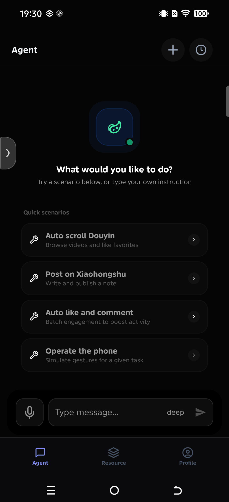
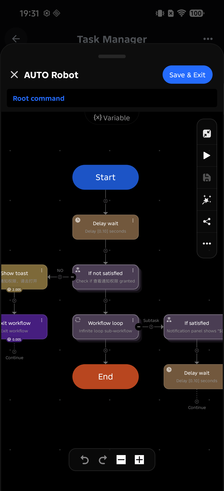
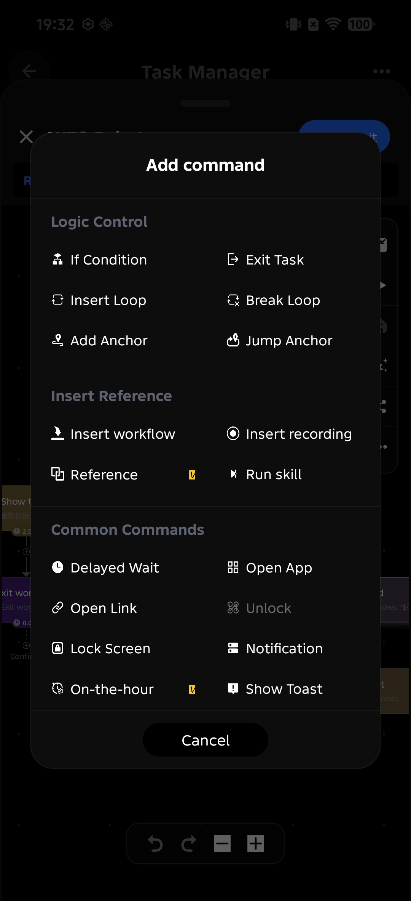
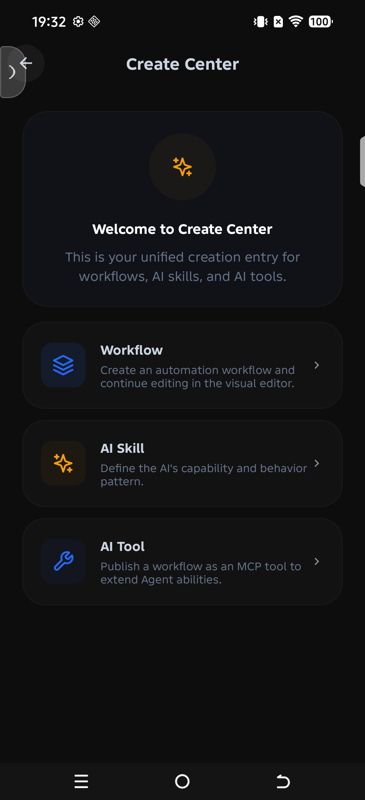
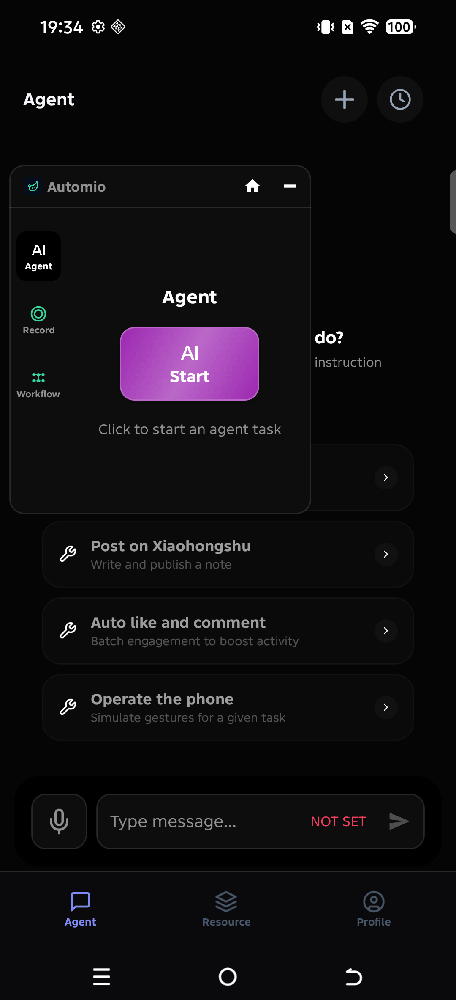

# Automio

[中文](README.md) | [English](README_EN.md)

**Automio: let AI actually operate your Android phone**

Automio is a **full-featured on-device Agent for Android**: it uses a large language model to understand what you want, then finishes the job with real device skills (tap the screen, read text, find images, open apps, run scripts).  
It is more than a chat box, and more than one-shot macro recording—**you can grow the capability boundary yourself**:

- Use **Skills** to extend *what it can do*
- Use **fixed workflows** to extend *how it does things reliably*
- Use the **visual / DSL editor** to lock complex flows so a human or the AI can call them later

**No Root. No Xposed / LSPosed.** Permissions are scoped by feature and requested on demand. It installs and runs on any brand of phone. Configure an AI key to go live; without AI, fixed workflows still run offline.

---

### What it can do in 30 seconds

| You want to… | How Automio does it |
| ------------ | ------------------- |
| Talk to the phone and have it finish a sequence of taps | **Agent chat** → tools / workflows → see screen, tap, report back |
| Run the same complex flow every day without re-explaining to the AI | Build a **fixed workflow**, one-tap or scheduled, offline |
| After a flow works, let chat call that capability next time | Publish as a **Skill / Tool**; Agent invokes it on demand |
| Survive UI redesigns that break pure coordinate macros | **Image / OCR / view** matching + visual editing |
| Let a desktop Agent use phone capabilities | **On-device MCP** as a LAN tool node |
| Avoid Root and framework fiddling | **Standard permissions** (accessibility, screen capture, …), dynamic grant, any OEM |

---

## Real-world usage

**1. “Freeze” a complex task once, then run it on autopilot**  
You maintain a long, highly fixed sequence (open an app → navigate → find a button → fill a form → confirm → screenshot and archive).  
→ Build a **fixed workflow** in the editor; run locally with one tap or an alarm. **No network, no token burn.**

**2. After it is stable, “teach” it to the AI**  
Same workflow, but you do not want to re-direct it in chat every time.  
→ Publish as an **AI Skill / Tool**. Next time you say “run last week’s archive flow”, the Agent **calls it directly**.

**3. Ad-hoc, hard-to-fix work → Agent improvisation**  
“Check notifications for a parcel, open the right app, read the pickup code.”  
→ Use the **chat Agent**: see screen, OCR, tap views, iterate until done. Fixed work → workflows; fuzzy work → Agent.

**4. Reuse across your own / team devices**  
Tune the flow on phone A.  
→ Export a `.zip` **bundle** (workflow + dependent Skills / Tools + permission declarations); import on phone B. No store required.

**5. Mix in compute and scripts**  
After collecting data you need to calculate or write files.  
→ Embed **Python** in workflow steps, then return to taps / uploads.

**6. Desktop Agents calling the phone**  
A coding Agent on a PC needs “open X on the phone and take a screenshot.”  
→ Enable **on-device MCP**; expose phone tools over the protocol.

In one line: **what can be fixed becomes a workflow** (offline, reusable, publishable as a Skill); **what cannot be fixed goes to the Agent**; both share the same device capabilities, and those capabilities keep growing.

---

## UI preview

|                     Agent chat                      | Visual workflow | Add command |
|:---------------------------------------------------:| :-------------: | :---------: |
|  |  |  |

| Creation hub | Resources & floating window |
| :----------: | :-------------------------: |
|  |  |

---

## Core capabilities

| Capability | Description |
| ---------- | ----------- |
| **Phone Agent** | Multi-step plan & execute: see screen, tap views, read text, open apps; write results back to chat until done |
| **Skill extension** | Custom prompts + tool constraints; callable from chat or via workflow `runSkill` |
| **Fixed workflows** | Visual editor + `.sc` DSL; run standalone, on a schedule, or publish as AI-callable tools |
| **Strong editor** | Node graph & source editing; image / OCR / coordinates / views / control flow |
| **Offline execution** | Workflows run without AI; with AI configured, models are called only when intelligence is needed |
| **MCP** | Device-side SSE / Streamable HTTP; expose tools on localhost or LAN |
| **Vision & OCR** | OpenCV find-image / find-color; ML Kit CN/EN OCR |
| **Voice** | Azure Speech TTS / ASR (`voiceInteract`, Agent voice input); credentials in Keystore |
| **Scheduler & Python** | Alarm-grade scheduled tasks; Chaquopy Python inside flows |
| **Standard permissions** | No Root / no Xposed; scoped, dynamic permissions; any Android phone |

### Workflow command cheat sheet

| Category | Examples |
| -------- | -------- |
| Gestures | `click`, `press`, `scroll`, `pinch`, `repeatTap` |
| Image / text / view | `clickImage`, `clickText`, `clickColor`, `clickView`, `readScreenText` |
| System | Back / Home, unlock, `openApp`, `openUrl` |
| Control flow | `delay`, `for`, `if`, `jump`, `callScript`, `set`, `log` |
| Smart extensions | `runSkill`, `aiRequest`, `python`, `voiceInteract` |

---

## Permissions & compatibility

- **Does not** use Root, Xposed, system hooks, or OEM-assistant hijacking
- **On demand**: accessibility, overlay, screen capture, notifications, etc.—request when needed, revocable in system settings
- **OEM-friendly**: not tied to a specific ROM / brand; any Android phone meeting `minSdk`
- API keys / speech credentials live in **Android Keystore**; with no Provider configured it **will not** call a default cloud
- Do not hardcode Speech keys in MCP `voiceInteract` or workflows; do not commit real Bearer tokens in `curl` headers

Only run workflows and Skills you trust; review dependencies and permission declarations before importing a bundle.

---

## How it compares

Most products own one niche. Few do all of: **actually operate the UI, freeze and reuse flows, expose them to AI, run offline, and install without Root on any phone**. Automio’s edge is not “another chat UI”—it is one capability chain that joins these pieces.

### Comparison table

| Dimension | Macro / Auto.js style | Chat-only App Agent (sandbox) | OEM phone assistant | Root / Xposed system Agent | Desktop RPA on phone | **Automio** |
| --------- | --------------------- | ------------------------------ | ------------------- | -------------------------- | -------------------- | ----------- |
| Real UI control | Strong (coords / simple find-image) | Weak or none | Limited, OEM-centric | Very strong (hooks) | Depends on port | **Strong (a11y + find-image / OCR / views)** |
| Freeze complex tasks | Scripts, uneven editors | Almost none | Almost none | Rare, ad-hoc | Heavy flows | **Visual + `.sc` DSL editor** |
| Call frozen flows from AI | Almost none | Described only in prompts | Closed | Rare | Rare | **Publish as Skill / Tool** |
| Offline fixed flows | Yes | No (cloud) | OEM services | Depends | Often needs server | **Yes (no AI required)** |
| Ad-hoc intelligence | None / weak | Yes, but cannot act | Yes, OEM bounds | Yes | Yes | **Yes (Agent + same device tools)** |
| Extensibility | Scripts / plugins | Mostly prompts | Closed | Hook modules | Connectors | **Skill + workflow + MCP + Python** |
| Scheduling | Sometimes | Rare | Limited | Rare | Yes | **Alarm-triggered workflows** |
| Distribution | Copy files, deps break | None | None | Module packs | Project import | **`.zip` bundle (deps + permissions)** |
| Model choice | — | Often locked | OEM-locked | Often BYOK | Product-dependent | **BYOK; no default cloud if unset** |
| Install bar | Low–mid | Low | Preinstalled | **High (Root / framework)** | Mid–high | **Low (standard permissions)** |
| Device coverage | Good | Good | Own brand only | ROM-sensitive | Good | **Any Android (minSdk)** |
| Security / compliance feel | Grey-area association | Cleaner | OEM-backed | Root risk | Enterprise | **Scoped, revocable, no system hooks** |

### Where others stall, and what we add

#### 1. vs macros / Auto.js / pure script automation

Great at repeat taps; familiar pain points:

- **Breaks on redesign**: coordinate-only recording; weak find-image or high edit cost  
- **Hard to maintain**: long scripts without visual graphs, subflows, Skill packaging  
- **Disconnected from AI**: a working script cannot be “taught” to the model  
- **Rough distribution**: copy files, lose image packs / deps  

**Automio:** find-image / OCR / views; editor for maintainable workflows; **one-click publish as Skill**; bundle deps for import.  
**Fit signal:** highly repetitive, multi-step, long-lived maintenance—freeze first, attach AI when needed.

#### 2. vs chat-only App Agents (sandbox “lobsters”)

Many “phone AIs” are cloud chat plus a few in-app tricks:

- **Cannot reach out**: no real third-party UI, or advice only  
- **Burns tokens for everything**: no offline fixed-path for repeats  
- **Closed capability surface**: users cannot add stable, reusable ways of working  

**Automio:** Agent can see, tap, and read; more importantly, **repeats need not ask the AI every time**—workflows offline; fuzzy work stays in chat.  
**Fit signal:** you want both conversational completion and a library of “no re-explain” skills.

#### 3. vs OEM phone assistants

Deep integration, smooth UX, but:

- **Ecosystem lock-in**: model, data, action scope set by OEM; hard BYOK / custom tools  
- **Cross-app limits**: commercial / compliance bounds on “tapping for you”  
- **Hard to own portable assets**: flows live in the system, not exportable bundles  

**Automio:** third-party path—**you pick the model, build workflows, export bundles**; no preinstall, no account store.  
**Fit signal:** you want control, portability, and self-built tools—not “whatever assistant the OEM shipped.”

#### 4. vs Root / Xposed system Agents

Hooks and private data access raise the ceiling, but:

- **High bar**: Root, frameworks, scopes, ROM ports—most users and devices drop off  
- **Fragile**: OS or target app major bumps can wipe hooks  
- **Risk / review optics**: enterprise, payments, banking often forbid Root  

**Automio:** deliberately chooses **standard permissions**—accessibility + capture + dynamic grants—for **any phone, daily environments, long-term maintenance**. Not competing on “who can dump WeChat’s DB”; competing on “who can make complex automation usable for most people, and keep expanding.”  
**Fit signal:** you must cover many devices and cannot require Root.

#### 5. vs desktop RPA / stuffing a coding Agent into a phone

Desktop RPA and coding agents are strong; on phones they often become:

- **Wrong environment**: no full desktop, no stable third-party APIs—still ends in tapping  
- **Heavy ops**: connectors, control planes, accounts—too much for individuals / small teams  
- **Missing local publishable assets**: hard to turn flows into pocket Skills / bundles  

**Automio:** built for phone UI automation (find-image, OCR, a11y nodes), then Agent, MCP, and local bundles; desktops can call the phone as a tool via **on-device MCP**.  
**Fit signal:** the battlefield is phone App UIs, not servers or IDEs.

### Decision sketch

```text
Can the task be highly fixed and repeated?
        │
        ├─ Yes → “fixed workflow” → one-tap / schedule / offline
        │         └─ Want it in chat too? → publish Skill / Tool for the Agent
        │
        └─ No (ad-hoc, needs judgment) → Agent chat + see/tap
                  └─ Later turns out fixable? → fold back into a workflow
```

**Automio’s strength is the loop, not a single peak score:**  
record → edit → run offline reliably → teach the AI → package & distribute → keep extending with MCP / Python / Skills—and **no Root, any phone**, end to end.

---

## Environment & build

- JDK 17, Android SDK 36  
- Application id: `com.agent.automio`
- **Prebuilt APK**: download from [GitHub Releases](https://github.com/AddBean/automio/releases) (pushing a `v*` tag builds and uploads automatically)

```bash
./gradlew :publish:zpublishScript:assembleDebug
```

APK output: `publish/zpublishScript/build/outputs/apk/`

```bash
./gradlew test
./gradlew :publish:zpublishScript:lintDebug
./gradlew scanI18n
```

Ship a release (CI signs with GitHub Secrets):

```bash
git tag v1.0.0 && git push origin v1.0.0
```

### Get started in three steps

1. Install the APK; grant accessibility and other permissions from the permission hub  
2. (Optional) **Settings → More → Model management** for AI; configure **Voice services** if needed  
3. Create a workflow or import a `.zip`; use Agent for chat, fixed flows for stability  

### Configuration (AI / speech / MCP)

**Do not commit secrets.** Prefer on-device **Android Keystore** (encrypted SharedPreferences).

| Purpose | Recommended setup | Notes |
| ------- | ----------------- | ----- |
| **AI Provider API Key** | In-app **Model management** | Stored in Keystore; no default cloud call if unset |
| **Azure Speech (TTS/ASR)** | **More settings → Voice services** | Key + Region; Agent voice input & `voiceInteract` / MCP `buildin.voiceInteract` |
| **iFlytek ASR (optional)** | `local.properties`: `automio.xfAppId` + `automio.audioAsrProviderId=xf` | Default provider is Microsoft (`ms`) |
| **On-device MCP** | After start, use local SSE / Streamable URLs | LAN tool exposure; do not put Bearer / custom headers in public scripts or git |
| **Workflow `curl` headers** | Local / private bundles only | Examples must not include real tokens; MCP `voiceInteract` **no longer** accepts `appKey` / `region` args |

For local debug only, you may inject via **gitignored** `local.properties` (values are baked into the APK):

```properties
automio.msSpeechKey=YOUR_AZURE_SPEECH_KEY
automio.msSpeechRegion=eastasia
# automio.audioAsrProviderId=ms
# automio.xfAppId=
```

Priority: runtime Keystore ＞ empty `buildMap` placeholders from `local.properties` / `publish.gradle`.

---

## Module layout

| Layer | Modules |
| ----- | ------- |
| App | `zpublishScript`, `appScript`, `baseApp` |
| Core | `libScript`, `libAgent`, `libMCP` |
| Features | `libAudio`, `libOpenCV`, `libOcr`, `libTimer`, `libPython`, `libEditor`, `libFiles`, `libImage` |
| Foundation | `libBase`, `libViews`, `libCompon`, `libUtils`, `libNet`, `i8n` |

---

## Limitations

- Depends on accessibility and screen-capture quality; some hardened / game-engine UIs are hard to recognize  
- No account system, no official store or cloud sync; distribution is local bundles  
- Python / OpenCV increase APK size and build time  

---

## License

MIT License — see [LICENSE](LICENSE). Third-party notices: [NOTICE](NOTICE).

Personal learning, research, and non-commercial use may follow the MIT terms directly. If you plan to use Automio in a **commercial product or commercial service**, please contact the author **jiadou** first (via this repo’s [Issues](https://github.com/AddBean/automio/issues)) to discuss collaboration or licensing.
